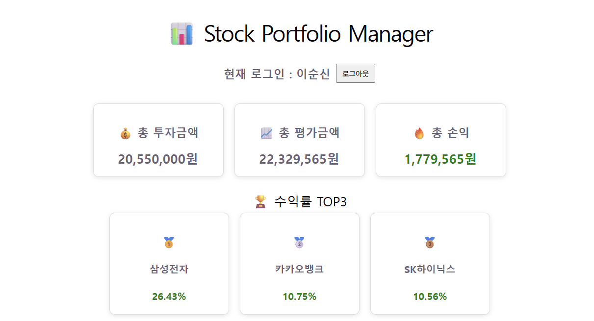
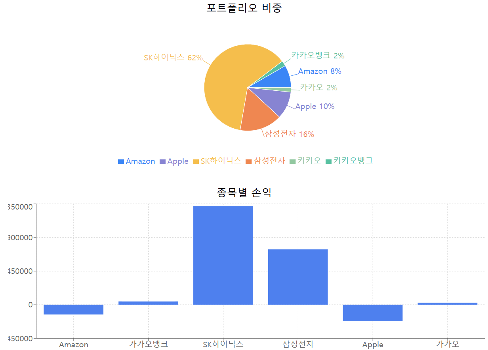
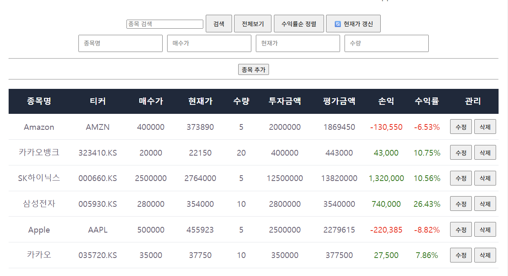

# 📈 Stock Portfolio Manager

실시간 주가와 환율을 활용한 주식 포트폴리오 관리 웹 애플리케이션

---

## 🚀 Demo

배포 후 추가 예정

Frontend:

* https://your-app.vercel.app

Backend:

* https://your-api.onrender.com

---

## 🛠 Tech Stack

### Backend

* Java 17
* Spring Boot
* Spring Data JPA
* Spring Security
* MySQL
* Lombok

### Frontend

* React
* Axios

### External API

* Yahoo Finance API
* USD/KRW Exchange Rate

---

## ✨ Features

### Authentication

* 회원가입
* 로그인
* 로그아웃
* BCrypt 비밀번호 암호화

### Portfolio Management

* 종목 추가
* 종목 수정
* 종목 삭제
* 회원별 포트폴리오 관리

### Stock Analysis

* 실시간 주가 조회
* 미국 주식 지원
* 한국 주식 지원
* 실시간 환율 조회
* 미국 주식 원화 환산

### Performance Tracking

* 총 투자금액 계산
* 총 평가금액 계산
* 총 손익 계산
* 총 수익률 계산

### Visualization

* 포트폴리오 차트
* 수익률 시각화

### Utilities

* 종목 검색
* 수익률 정렬
* 현재가 갱신

---

## 📷 Screenshots

### Main

### Chart

### Dashboard

---

## 🗄 Database Structure

### Member

| Column   | Type   |
| -------- | ------ |
| id       | Long   |
| email    | String |
| password | String |
| name     | String |

### Stock

| Column       | Type    |
| ------------ | ------- |
| id           | Long    |
| stockName    | String  |
| ticker       | String  |
| quantity     | Integer |
| buyPrice     | Integer |
| currentPrice | Integer |
| member_id    | Long    |

---

## 📌 Project Architecture

React Frontend

⬇ REST API

Spring Boot Backend

⬇ JPA

MySQL Database

⬇

Yahoo Finance API

---

## 🔥 Future Improvements

* 관심 종목 기능
* 자동 주가 갱신
* 알림 기능
* AWS 배포
* Docker 적용
